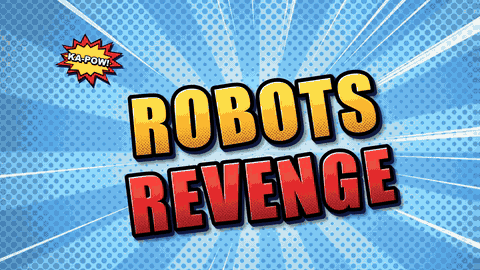

# kid-movie-studio

**Make a real-looking movie with your kid, using a plain wall and a computer.**



<sub>The demo film (`kms demo --film`): drawn toy robots, keyed off a painted wall. No real people.</sub>

You film. The studio does the fiddly bits: it cuts your kid out of any plain painted
wall (no green screen needed), and makes TV-style titles, a news intro with the pips, name
captions, a signal-lost glitch, a villain's voice, credits and an end card. Then it hands
every creative decision to the kid.

- **The kid directs.** Every choice in the film (the title style, the channel name, what
  happens when the camera gets smashed, the villain's voice, whether its eyes glow, the
  ending, the poster, the running order, even their job title in the credits) is a pick they make from real
  previews on a tablet. The previews are the finished pieces, so what they pick is exactly
  what ends up in the film.
- **The grown-up gets guided.** `kms next` tells you what to do now, who does it (you,
  both of you, or the director), and even something to say. It's a team effort, and the
  computer jobs run while you're filming the next bit.
- **Everything stays on your computer.** No footage is uploaded anywhere.

> The first film made this way was *Robots Revenge*, a fake 9 o'clock news report on a
> robot invasion, shot in one afternoon. [How it was made](docs/PROCESS.md).

## Try it in a minute

You need Python 3.10+ and [ffmpeg](https://ffmpeg.org/) (`brew install ffmpeg` on a Mac,
`sudo apt install ffmpeg espeak-ng` on Linux).

```bash
pipx install git+https://github.com/jhammant/kid-movie-studio   # or: uv tool install …
kms demo robot-demo --film     # a whole film with drawn toy robots: no real people
open robot-demo/kit/*.mp4
```

## Make your own

```bash
kms init my-film --director Robin   # Robin is your kid's first name or nickname
cd my-film
kms next                            # the guide: what to do, who does it, what to say
```

`kms next` walks you through the whole thing:

| | Step | Who | What happens |
|---|---|---|---|
| 1 | Plan the film | 🤝 together | Answer the questions in `movie.yaml`: the title, the cast, the villain. |
| 2 | Filming day | 🤝 together | A shot list, made from your running order. The director says "Action!". |
| 3 | Green screen | 👤 grown-up | `kms key` cuts the kid out of the plain wall and into the scene. |
| 4 | Make the choices | 👤 grown-up | `kms previews` renders every option as a real preview. |
| 5 | Pick | ⭐ the director | `kms picks` opens the pick page; scan its QR code with a tablet. |
| 6 | Put it together | 👤 grown-up | `kms assemble` builds the film from the picks. |
| 7 | The premiere | 🤝 together | Watch it, then re-pick anything and assemble again. |
| 8 | Share | 👤 grown-up | `kms export --phone`, `--imovie` or `--media-server`, if you want. |

For the day itself (what to film, keeping a seven-year-old in charge, and what to do when
it goes wrong), read the [parent's guide](docs/PARENTS.md).

## The plain-wall green screen

Any plain painted wall works, as long as you also **film 3–5 seconds of the empty wall**
at the end of the take, in the same light, with the camera still. The studio uses that
"clean plate" to relight every frame and score each pixel on colour as well as brightness,
so shadows stay wall and hair stays hair. It also writes a pure-green copy for iMovie's
own green-screen tool.

Wear colours that are different from the wall. A green jumper on a green wall means an
invisible jumper.

## The pick page

`kms picks` serves the page from your computer, and any tablet on the same Wi-Fi can open
it (the page shows a QR code). It has big buttons, one video per option, a "Surprise me!"
die, a running-order list with up and down arrows, and an "Anything to change?" box for the
director's ideas. Every tap saves straight into the `picks:` block of `movie.yaml`, and
`kms assemble` reads only that. Change a pick, assemble again, and the film changes.

If you use [Claude](https://claude.ai), the same page can be published as an artifact
instead (`kms picks --artifact DIR`). That uploads the previews, so it's opt-in.

## With Claude Code

The studio comes with a Claude Code skill that acts as your assistant director. It runs
the guide, explains each step in plain words, looks at the footage, renders the slow bits
in the background, and turns the director's notes ("make the title more sparkly") into new
options to pick from. It never makes a creative choice for the kid.

```bash
kms skill --install      # copies the skill into ~/.claude/skills/
```

## movie.yaml

One file per film. `kms init` writes a commented example. The parts:

```yaml
title: ROBOTS REVENGE
crew: {director: Sam, grownup: Alex}          # first names or nicknames only
cast:
  - {character: Penny Sparks, role: Roving Reporter, actor: Sam}
story: {villain: ROBOT, villain_line: "We'll see, Penny... We'll see...", hero: Penny}
channels: [{name: "{initial}BC NEWS", strapline: "{director} Broadcasting Corporation"}]
scenes:                                       # the running order
  - pick: title                               # a piece the kid picks
  - clip: desk-intro.mp4                      # a clip from footage/
    caption: Rex Newsome
  - key: wall-take.mp4                        # a plain-wall take, keyed over a background
    background: water-robots.mp4
  - make: credits                             # made from this file
picks: {}                                     # written by the pick page
```

A grown-up can hide an option or lock a choice under `choices:`.

## Requirements

- Python 3.10+, with numpy, OpenCV, Pillow, SciPy and PyYAML (installed for you).
- ffmpeg. Builds without the `drawtext` filter are fine: all text is drawn with Pillow.
- Speech: macOS `say`, or `espeak-ng` on Linux and Windows.
- Optional: [whisper](https://github.com/openai/whisper) for transcripts in `kms analyse`.

On a Mac the graphics use the system fonts they were designed with. Everywhere else they
use bundled open-licence fonts (Anton, Archivo Black, Barlow, Bangers, Comic Neue,
Courier Prime, Space Mono, Arvo).

## Development

```bash
uv venv && uv pip install -e '.[dev]'
pytest -m "not slow"          # fast checks; `pytest` renders every piece at full length
```

Every generator lives in `kms/render/` and can be run on its own, e.g.
`python -m kms.render.title_computer out.mp4 --title "THE DINOSAUR DISCO"`.

## Licence

MIT. The bundled fonts are under the SIL Open Font License (see `kms/fonts/OFL-*.txt`),
and the QR code library is MIT (see `kms/picks/QRCODE-LICENSE.txt`).
